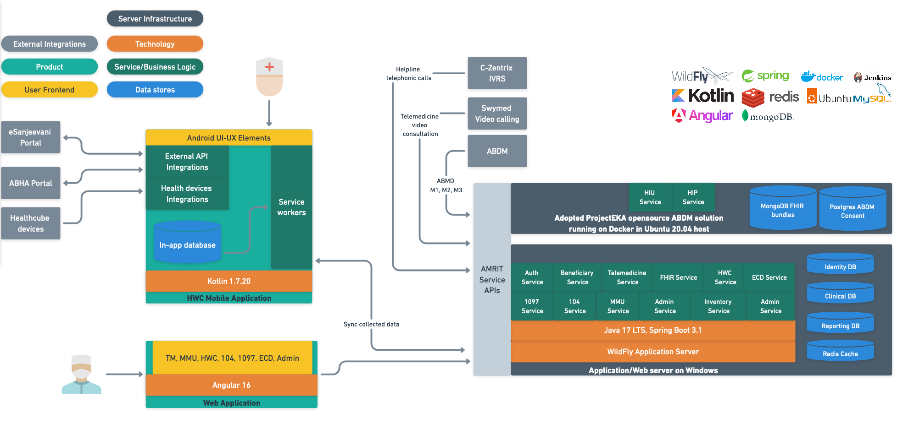

# System architecture overview

AMRIT is primarily built around the Java Spring Boot framework and as outlined in earlier sections provides multiple services oriented around the community health records ecosystem. AMRIT is deployed in multiple states on a non-profit model. Patients, HWCs and PHCs are the key stakeholders. AMRIT can be accessible from various channels like web portal, API access, mobile app and telemedicine.

**Technology Elements**

* JDK 17 LTS, SpringBoot 3.2
* Angular 16
* Wildfly 30&#x20;
* MySQL 8
* Redis
* MongoDB - FHIR Resource
* OpenKM on Tomcat
* Project EKA - ABDM Service
* PostgreSQL

A diagrammatic representation of the AMRIT platform and various technical blocks is below.

<figure><figcaption></figcaption></figure>
